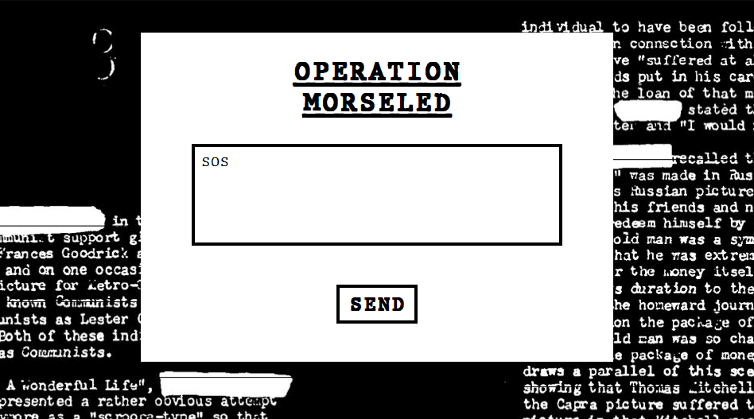

This project contains a web application for sending text to an Arduino device which then outputs it in Morse code (in beeps and flashes).

# Libraries
* Arduino IDE `1.8.7`
* Python `3.6.1`
* Flask `1.0.2`
* PySerial `3.4`

# Running
* Open the `hardware/morse_blink/morse_blink.ino` Arduino script
* (Set LED and buzzer pins, 11 and 12 by default)
* Hook up a LED and a buzzer to your Arduino
* Upload the script to your Arduino
* In a terminal, `cd` to the `server` directory
* Run `host_dev.bat <serial port>` (Windows, serial port can be something like `COM5` - can check with the Arduino IDE) or `host_dev.sh <serial port>` (Linux) to launch the server
* Open `http://127.0.0.1:5000/` in a web browser (only tested with Firefox and Chrome on desktop)
* Write something in the text area and click the `SEND` button
* For `SOS` as sample input, the buzzer should chirp and the LED flash quickly three times, then slowly three times, then quickly three times
* Alternatively for testing without a server/GUI, use the `server/arduino_test.py` script

# Implementation details
## Arduino
Practically the Arduino could be a dead-simple client with all logic done on the server. But it's fun if we give the Arduino more autonomy. So the Arduino accepts an ASCII-like character string and translates it into Morse code.

Some over-engineered moments:
1. The letter to Morse code mapping array is generated using a Python script where the Morse codes are defined in standard notation (. and -). I had previously tried using pre-processor macros and constexpr to do this but I didn't get anywhere.
2. A letter's Morse code is stored using 8 bits. 0 corresponds to dot and 1 to dash and there's a leading 1 to denote the beginning of the pattern. The leading 1 saves memory (avoids having to store pattern length - the Arduino is quite constrained in the memory department) at the cost of runtime performance. When searching for the leading 1 the first two bits can be skipped at the outset (pattern + leading 1 are 6 bits at most) but I didn't bother implementing this optimization.
3. It's possible to tell the Arduino to stop the current task (clear buffer) to setup a new task.

### Data transfer
Data transfer is done using a polling mechanism (driver asks Arduino how much space it has before sending data chunks). It avoids stressing the serial connection (which can get filled up pretty quickly due to multiple `delay()` calls in the Arduino script). It also avoids sending the Arduino more data than it can store in the script's circular buffer.

The driver uses a separate thread for reading from the Arduino which requires coordination between receiving polling results and sending data chunks. It might have been easier if I had used PySerial's blocking calls but I ran into some issues on that side. Ideally I would have written it as blocking, sequential code.

### Blocking main loop
Currently the main loop halts (with `delay`) the entire program to control the output devices. In the real world it should plan out a timeline of actions at regular intervals instead. This timeline would be checked every loop iteration without perceptibly delaying the loop execution.

## Server
TODO

## Client
TODO

# Possible improvements
* GUI indicator of which character is being processed by the Arduino right now
* GUI to set the buzzer volume, LED intensity, Morse code output speed, turn buzzer or LED on/off
* Use physical switch to also read Morse code from the Arduino
* Non-blocking main loop on the Arduino
* Sequential, blocking code for serial communication in driver
* Multi-user requests queuing + publicly visible task list
* Prevent send_text buffer overflow (MORSE_EXT_CANCEL and MORSE_EXT_POLL are sent unconditionally)
* GUI mobile-friendly layout + accessibility
